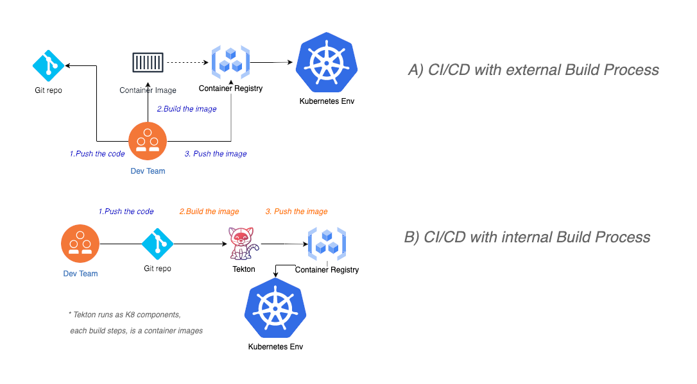

# How to integrate your CI/CD with Openshift Pipeline (Tekton)
During last decades, several CI/CD toolchains becomes popular and companies started to adopt different tool to build and deploy their code.
Some of the most used tool were Jenkins, Git, TFS/Azure DevOps, IBM Urban Code.

With the diffusion of containers and Kubernetes, the build process is a step that could easily handled by developers for their unit test. When using




In order to introduce security, standard and controls on their production software, large organization prefer to manage their build process and adopt a well defined process for the build phase:
<strong> architects and DevOps teams decide their source images and library where developer code will run</strong>.

A couple years ago, a new pipeline tools was propoced to in order to integrate a container build phase on top of the Kubernetes platform. 
Tekton community was release on and later adopted as Red Hat capabilities for their Openshift platform.

The latest Openshift pipeline version guarantee a simple UI to build your task and pipelines. 
Moreover we can expose the pipeline throu a REST webhook to be interated with our Git platform or existing CI/CD toolchains

## Prerequisites
In order to use Openshift Pipelines, we can adopt and expand [this tutorial](https://github.com/openshift/pipelines-tutorial) to deploy the Openshift Pipelines on our cluster and build a simple

* Install Openshift Pipeline
* Deploy our sample pipeline with few tasks
* Expose our triggers to call our pipeline


## A sample webhook call
After we expose our pipeline, we can call it through the Git Webhook, as expressed in the tutorial or we can wrap the  to an external integration tool

This is an example of the REST call to simulate the Git Webhook, with the minimal payload to run the sample pipeline

```
 curl -X POST  -H "x-github-event":"push" -H "content-type":"application/json"  -d@my.json <Pipeline Route>

 my.json
    {
    "repository": {
        "name": "pipelines-vote-ui",
        "url": "https://github.com/openshift/pipelines-vote-ui.git",
        "master_branch": "main"
    }
```
